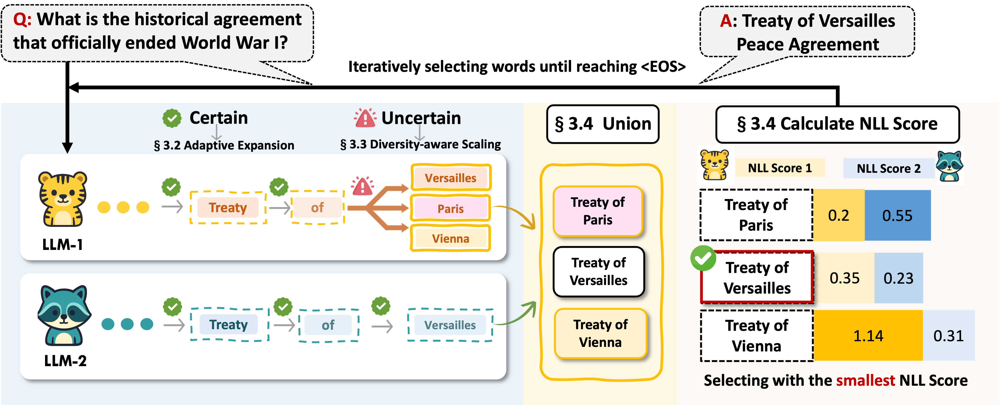

# AdaFuse: Adaptive Ensemble Decoding for Large Language Models

[](https://opensource.org/licenses/MIT)
[](https://www.python.org/downloads/)
[](https://pytorch.org/)

## Overview

**AdaFuse** is an adaptive ensemble decoding framework that dynamically combines multiple large language models (LLMs) during inference. Unlike traditional fixed-granularity ensemble methods, AdaFuse adapts its fusion strategy on-the-fly based on model confidence and generation context, achieving superior performance across diverse NLP tasks.

### Key Features

- **🎯 Adaptive Word-Level Fusion**: Dynamically adjusts fusion granularity during generation based on decoding context
- **🔍 Confidence-Guided Decoding**: Uses uncertainty-based criteria to decide when to apply ensembling
- **🚀 Diversity-Aware Scaling**: Explores alternative continuations only when needed, balancing effectiveness and efficiency
- **📈 Strong Performance**: Achieves 6.88% average relative improvement over strong ensemble baselines
- **🔧 Training-Free**: Works with any pre-trained LLMs without additional training

## Method



AdaFuse introduces an adaptive ensemble decoding strategy that:

1. **Confidence Assessment**: At each decoding step, evaluates model confidence using top-1 margin (Δ_k)
2. **Adaptive Commitment**: 
   - High confidence → Generate longer word spans directly
   - Low confidence → Invoke diversity-aware exploration
3. **Ensemble Decision**: Generates multiple candidate continuations and selects the best one based on ensemble scoring
4. **Mid-Generation Correction**: Enables flexible correction during generation, not just post-generation


## Results


AdaFuse demonstrates consistent improvements across diverse NLP tasks, including open-domain question answering (Natural Questions, TriviaQA), reading comprehension (SQuAD), arithmetic reasoning (GSM8K), and machine translation (FLORES). The framework achieves an **average relative improvement of 6.88%** over strong ensemble baselines, with particularly notable gains on challenging QA tasks.

## Environment & Requirements

### Prerequisites

- Python 3.8 or higher
- CUDA-compatible GPU (recommended for inference)
- 16GB+ GPU memory for 8B models

### Required Packages

- `torch>=2.0.0`
- `transformers>=4.30.0`
- `datasets>=2.0.0`
- `accelerate>=0.20.0`
- `sacrebleu>=2.0.0`
- `word2number>=1.1`
- `sentencepiece>=0.1.99`
- `protobuf>=3.20.0` 

## Usage

### Two-Model Ensemble

```bash
python AdaFuse_two_models.py \
  --test_set path/to/test_set.jsonl \
  --prompts path/to/prompts.txt \
  --model_path1 meta-llama/Llama-3.1-8B-Instruct \
  --model_path2 internlm/internlm3-8b-instruct \
  --output_file output.jsonl \
  --theta_delta 0.7 \
  --max_words 3 \
  --max_total_tokens 512
```

### Key Parameters

- `--theta_delta`: Confidence threshold for adaptive decoding 
  - Higher values → More conservative, fewer ensemble decisions
  - Lower values → More exploration, more ensemble decisions
- `--max_words`: Maximum words to generate per step 
- `--max_total_tokens`: Maximum total tokens for generation (default: 512)


